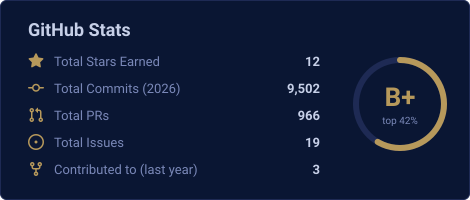
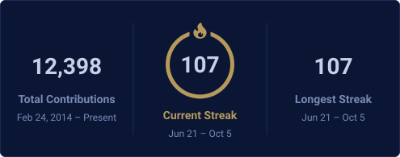
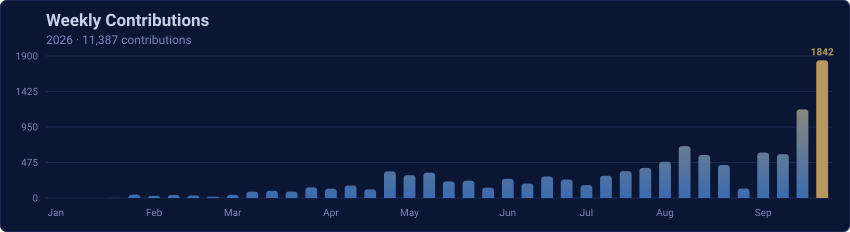

<h1 align="center">Hi, I'm Chance 👋</h1>

  <b>FullStack Engineer @ Authright</b>

  💎 Currently developing my personal project, <b>Lazuli Studio</b>.
   
  I work across the stack — Java &amp; Python on the backend, TypeScript &amp; React on the front,
   
  Rust when it needs to be fast, and Three.js when it needs to be in 3D.

 

<h3 align="center">🛠️ Tech Stack</h3>

  

 

<h3 align="center">🤖 Agent Stack</h3>

  💠 <b>Lazuli Studio</b> — a Bring Your Own Agent (<b>BYOA</b>) orchestrator: an agent + task / workflow scheduler.
   
  The Fleet it drives:

  

 

<h3 align="center">🧠 Model Arsenal</h3>

  

 

<h3 align="center">📊 GitHub Stats</h3>

  

  

  

